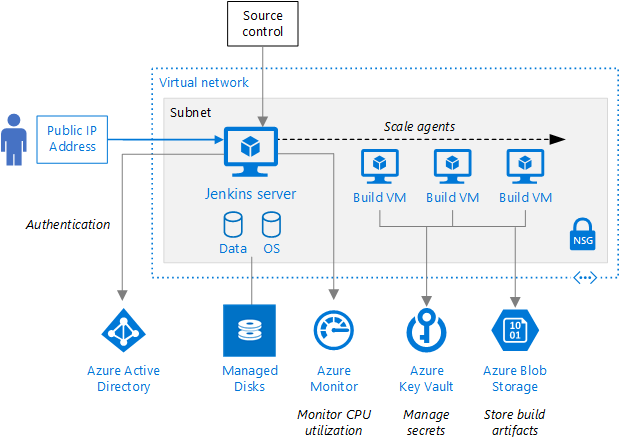

[Jenkins](https://jenkins.io/) is a very popular Java-based open source continuous integration (CI) server that allows teams to continuously build applications across platforms.

Visual Studio Team Services (VSTS) includes Team Build, a native CI build server that allows compilation of applications on Windows, Linux and Mac platforms. However, it also integrates well with Jenkins for teams who already use or prefer to use Jenkins for CI.

There are two ways to integrate VSTS with Jenkins

- One way is to completely **replace the VSTS Build with Jenkins**. This involves the configuration of a CI pipeline in Jenkins and a web hook in VSTS that invokes the CI process when source code is pushed by any member to a repository or a branch. The VSTS Release Management will be configured to connect to the Jenkins server through the configured Service Endpoint to fetch the compiled artifacts for the deployment.

- The alternate way is to **use Jenkins and Team Build together**. In this approach, a Jenkins build will be nested within the VSTS build. A build definition will be configured in the VSTS with a Jenkins task to queue a job in Jenkins that downloads the artifacts produced by the job and publish it to the VSTS or any shared folder. The VSTS Release Management will pick these build artifacts for deployment.

While there are pros and cons with both the approaches, the latter approach has multiple benefits:

1. End-to-end traceability from work item to source code to build and release
1. Triggering of a Continuous Deployment (CD) when the build is completed successfully
1. Execution of the build as part of the branching strategy

## What's covered in this lab

This lab covers both the approaches and the following tasks will be performed

- Provision Jenkins on Azure VM using a Jenkins Template available on the Azure Marketplace
- Configure Jenkins to work with Maven and VSTS
- Create a build definition in Jenkins
- Configure VSTS to integrate with Jenkins
- Configure Release Management in VSTS to deploy the build artifacts from Jenkins

## Reference Architecture

