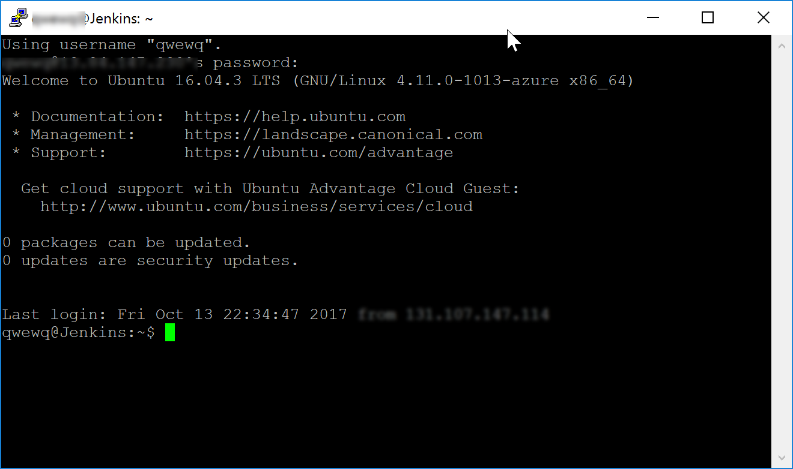
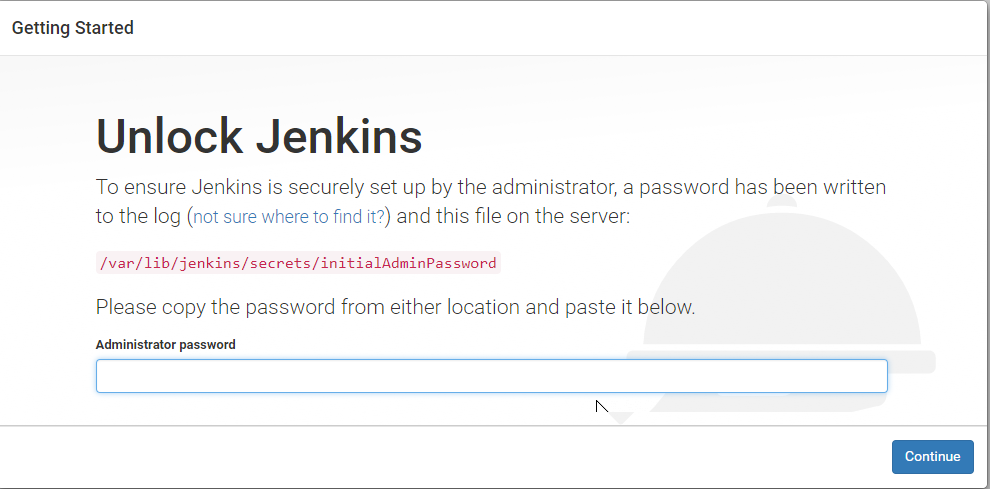
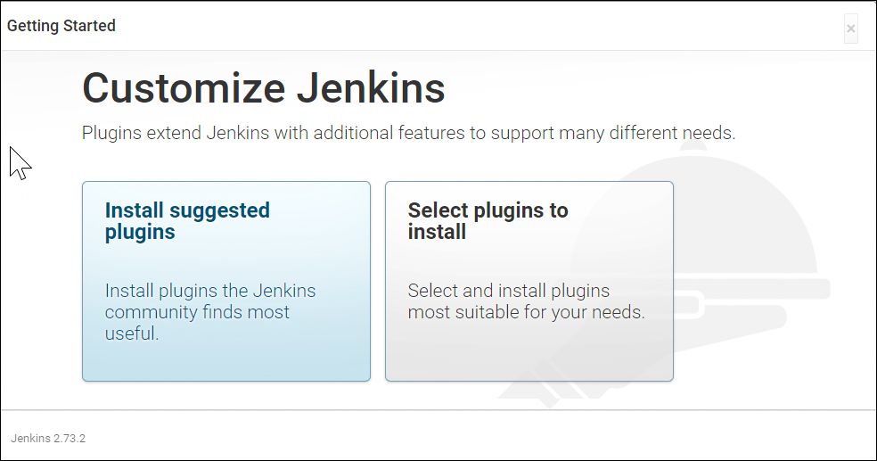
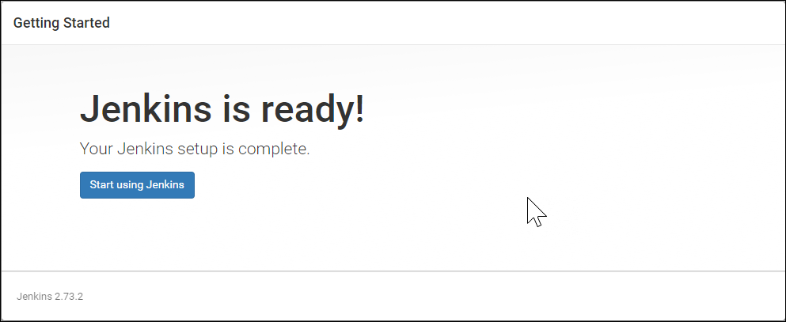

## **Scenario 3: Setting up Jenkins VM**

1. Once the Jenkins VM is provisioned, click on the Connect button and make a note of the username and the ip address. This information will be required to connect to the Jenkins VM from **Putty**

1. > **Note**
Jenkins, by default, listens on port 8080 using HTTP. To configure a secure HTTPS connection, an SSL certificate will be required. If HTTPS communication is not being configured, the best way to ensure the sign-in credentials are not leaked due to a "Man-in-the-middle" attack is by logging-in using the SSH tunneling. An SSH tunnel is an encrypted tunnel created through a SSH protocol connection, that can be used to transfer unencrypted traffic over an unsecured network.

1. To initiate a SSH tunnel, the following command needs to be run from a Command Prompt.

> putty.exe -ssh -L 8080:localhost:8080     `<username>`@`<ip address>`

 

>To run the above command, either the Putty.exe needs to be placed in the path selected in the Command Prompt or the full path of the Putty.exe need to be provided in the command.

4.  Login with the user name and password that was provided during the provisioning of the Jenkins VM.

1. Once the connection is successful, open a browser on the host machine and navigate to the URL http://localhost:8080. The Getting Started page for Jenkins will be displayed.

1. The initial password needs to be provided in the Getting Started screen to unlock Jenkins. For security reasons, Jenkins will generate a password and save it in a file on the server.

> At the time of writing this lab, an open issue in Jenkins was noted where the setup wizard would not resume after restart, skipping some of the steps listed below. If you do not see the screen below, skip the rest of the section and see [Logging into Jenkins](https://github.com/Microsoft/almvm/tree/master/labs/vstsextend/Jenkins#logging-into-jenkins-with-the-default-credentials) with the default credentials

7. Return to the Putty terminal and type the following command to open the password file and copy the password. Press the Esc button and then type :q! at the prompt to exit the vi editor without saving the file.

>sudo vi /var/lib/jenkins/secrets/initialAdminPassword

>You can double click on the password text and use CTRL+C to copy the text and place it in the clipboard

9. Return to the browser, paste the copied text in the Administrator password text box and click on the Continue button.

>Jenkins has a vast ecosystem with a strong and active open source community users contributing hundreds of useful plugins. While configuring Jenkins, choose between installing the most commonly used plugins or selected plugins.

10. The Maven plugin is also required for the lab but will be installed later. Click on the Install suggested plugins option to initiate the configuration.

11. Jenkins will now be ready for use. Click on the Start using Jenkins button to start using it.

