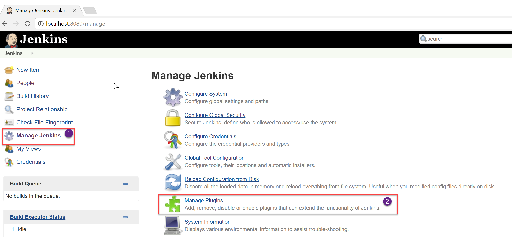
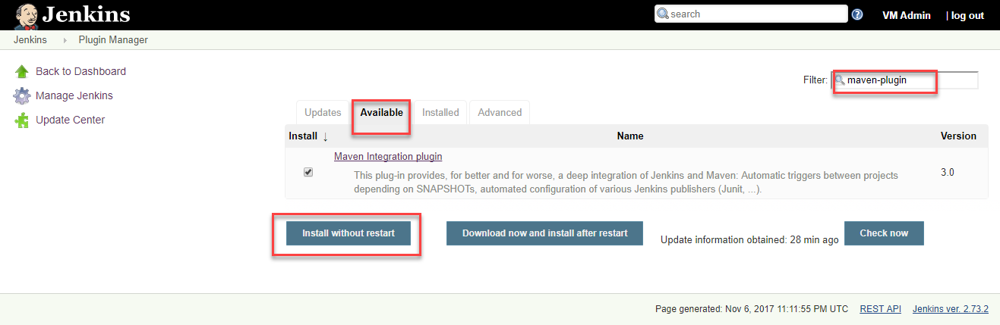
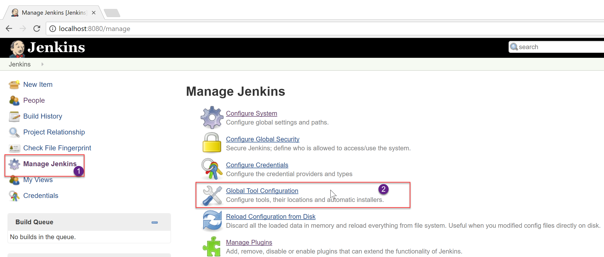
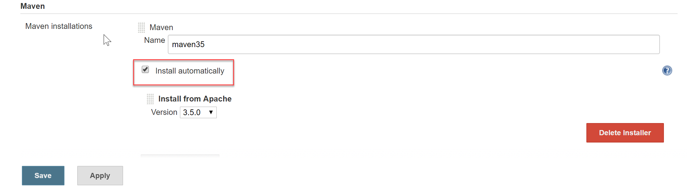

## **Installing and Configuring Maven**

> Starting with Jenkins version 2, the Maven plugin is not installed by default. The plugin needs to be manually installed.

1. Click the Manage Jenkins option on the Jenkins home page to navigate to the Manage Jenkins screen, the centralized one-stop-shop for all the Jenkins configuration. From this screen, the configuration of the Jenkins server, the installation and upgrades of plugins, keeping track of system load, managing distributed build servers can be managed.

2. Click on the Manage Plugins option, select the Available tab and search for _maven-plugin_ in the filter box.

3. Select the Maven Integration Plugin and click on the Install without restart button to install the plugin.

4. Once the plugin is installed, click on the Global Tool Configuration option.

> Jenkins provides great out-of-the-box support for Maven. Since the Maven is not yet installed, it can be manually installed by extracting the tar file located in a shared folder. Alternatively, when the Install automatically option is selected in the Global Tool Configuration screen, Jenkins will download and install Maven from the Apache website when a build job requires it.

5. To install Maven, select the Install automatically option and click on the Apply button.

>The latest version of Maven at the time of writing the lab was 3.5

6. Click on the Back to Dashboard button to return to the home page.

