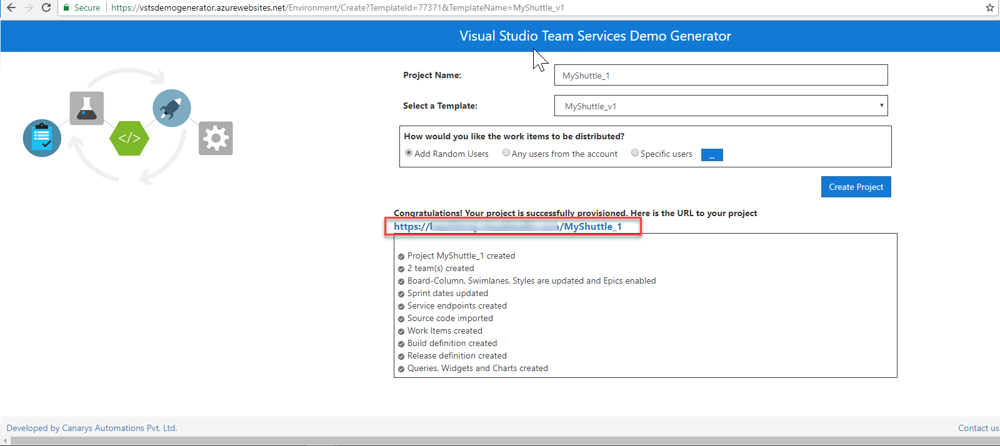

## **Scenario 1 - Setting up the VSTS team project**

Use the [VSTS Demo Generator](https://vstsdemogenerator.azurewebsites.net/?Name=MyShuttleDocker&TemplateId=77373) to provision the MyShuttleDocker sample project on to your VSTS account.

  > **VSTS Demo Generator** helps you create team projects on your VSTS account with sample content that include source code, work items,iterations, service endpoints, build and release definitions based on the template you choose during the configuration.

  

  2. Provide a project name and click **Create Project**. If the Docker Integration extension is not installed,the Click Project would not be available until the extension is installed and enabled on the account. Click the on the extension name to install the extension from the marketplace.

  

  > Using the VSTS Demo Generator link will automatically select the MyShuttleDocker template in the demo generator for the team project creation.